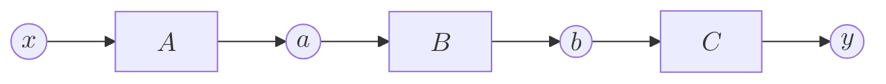
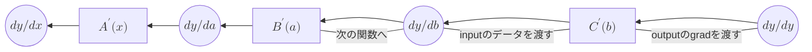

# 微分の実装(手動)
前の章では微分の理論について説明してきましたが、この章ではVariable構造体とFunctionトレイトを拡張して微分をもとめていきます。

## Variable構造体とFunctionトレイトの拡張
Variable構造体は微分の値を保持するために、通常の値に加えてそれに対応した微分の値を持つように変更します。いままでのFunctionトレイトは通常の計算をする機能しか持っていませんでした。そのため微分の計算をするbackward機能と、逆伝播のために順伝播する際に入力された値を保持する機能を追加します。

```rust
#[derive(Debug)]

struct Variable {
    data: f32,
    grad: Option<f32>,

}
impl Variable {
    fn new(data: f32) -> Self {
        Variable { data, grad: None }
    }
}

trait Function {
    fn call(&mut self) -> Variable;
    fn forward(&self, x: f32) -> f32; // 引数f32
    fn backward(&self, gy: f32) -> f32; // 引数f32

   }
```
Variableはフィールドとして初期状態や勾配が不要な場合はNoneとし、逆伝播で計算された後にはSome(f32)で値を持つようにするためOption&lt;f32&gt;型でgradを保持させます。関数 `new()` にgradとしてNoneを持たせgradを保持します。今後、構造体のコンストラクタを作成する際は、この `new()` を使って作成します。pythonでいうinit__(self、)です。

Functionトレイトは `call()` も変更し、`backward()` を追加します。以前のcall()は `&self` にしていましたが、`&mut self` に変更します。なぜならcall()の中でFunction構造体のフィールドであるinputを変更するため、selfを可変で渡す必要があるからです。
また前のcall()にはinputを渡していましたが、今回はそれを削除します。その理由は次の4.2の変更でわかります。

## Function構造体の拡張
続いて、具体的な関数の逆伝播を実装していきます。まずは2乗の計算をするSqure構造体です。\\(ｙ＝x^2\\)の微分は\\(2x\\)となることから実装します。次に\\(ｙ＝e^x\\)の計算をするExp構造体です。この微分の値は\\(e^x\\)となりこれをもとに実装していきます。
>今後も数学的な関数を実装していくうえで、微分の説明は省略することがあります。

```rust
/// 新しい設定
struct Square{
    input: Variable,
}
impl Function for Square {
    fn call(&mut self) -> Variable {
        let x = self.input.data; //inputのデータをフィールドから得る
        let y = self.forward(x);
        let output = Variable::new(y);
        output
    }

    fn forward(&self, x: f32) -> f32 {
        x.powf(2.0)
    }

    fn backward(&self, gy: f32) -> f32 {
        let x = self.input.data;
        2.0 * x * gy // gxを表す
    }

}

impl Square {
    fn new(input:&Variable) -> Self {
        Self { input: input.clone() }　//ここでinputをフィールドとして持つ
    }
}

fn square(&x:Variable) -> Variable {
    let f = Square::new(x);
    let y = f.call();
    y
}
```

```rust
// 前のcall()の設計の場合　この下のコードは以前の設計のものです。間違えないようにしてください。　

struct Square{
    input: Option<Variable>, //Option型にしなければならない
}
impl Function for Square {
    fn call(&mut self,input:&Variable) -> Variable {
        let x = input.data; //引数のinputからデータを得る
        self.input = Some(input.clone()); //ここでinputを保持
        let y = self.forward(x);
        let output = Variable::new(y);
        output
    }

    fn forward(&self, x: f32) -> f32 {
        x.powf(2.0)
    }

    fn backward(&self, gy: f32) -> f32 {
        let x = self.input.unwrap().data; //unwarp()を使わないといけない
        2.0 * x * gy // gxを表す
    }

}

impl Square {
    fn new() -> Self {
        Self { input: None }　//はじめは持っていないので、None
    }
}

fn square(&x:Variable) -> Variable {
    let f = Square::new();
    let y = f.call(x);
    y
}
```
call()のところはFunctionトレイトと同じように揃えます。call()の中の変更点としてinputのデータであるxの取得方法です。前はcall()にinputを渡していましたが、今回はフィールドから得ています。なぜこのようなことができるようになったかというと、2.3で実装した構造体を呼び出す関数のおかげです。この関数で構造体を呼び出す際に同時にinputを構造体にinputフィールドとしてはじめから持たせることで、call()に渡さなくても、inputにアクセスできるというわけです。


なぜこのように変更したかというと、**Option型を多用しないため** です。


以前の設計の場合のコードを見てみましょう。新しい関数インスタンスを作成するための `fn new() ->Self` の戻り値は `Self { input: None }` と、初期状態では入力が未設定であるため、inputフィールドをNoneで初期化する必要があります。するとここでinputフィールドはOption型で保持しなくてはなりません。Option型はエラーの原因となりやすく、また `unwrap()` など、取り出すのにコードが長くなったりと、あまり多用すべきものではありません。一方、新しい設計の場合、Option型を使わずに実装できています。

new()関数はすべての**Function構造体** に定義されますが、Functionトレイトから外し、個々の構造体にそれぞれ実装しています。その理由は5.6の可変長への拡張のところで説明します。

逆伝播のbackwardメソッドを追加します。順伝播時(つまりcall()の処理中)に記憶しておいた入力x の値を `self.input.data` として取り出します。このメソッドでは出力側から伝わる微分が渡されます。合成関数の微分の公式より（3.2を参照）、「引数で渡された出力側から伝わる微分の値」（backwardの中の**gy** を表す）と「その関数のinputの値」（backwardの中の**x** を表す）を使って計算したその関数での微分の値(squareの場合、導関数は2xなので、xにinputの値を代入して出た値)を掛け算してその値をf32型として返していきます。

## バックプロパゲーションの実装
実際に微分をしてみましょう。
```rust
fn main() {
    let mut x = Variable::new(0.5);
    println!("{:?}", x);

    let mut A = Square::new();
    let mut B = Exp::new();
    let mut C = Square::new();

    let mut a = A.call(&x);
    let mut b = B.call(&a);
    let mut y = C.call(&b);

    y.grad = Some(1.0);
    b.grad = Some(C.backward(y.grad.unwrap()));
    a.grad = Some(B.backward(b.grad.unwrap()));
    x.grad = Some(A.backward(a.grad.unwrap()));
    println!("{}", x.grad.unwrap());
}
```



<br>  




---


先ほどの「**バックプロパゲーションの理論**」の図と同じものを用意しました。前半のコードは図の上の順伝播の計算、いわゆる普通のy = f(x)でxに値を代入してyを求める処理をしています。後半のコードは図の下の逆伝播（バックプロパゲーション）で、yをxで微分した値を求めています。図の上と下では赤い線で結ばれていますが、これは例えばXとdy/dxなら、Xはdy/dxをX.gradとして保持しているということです。変数のgradの更新が行われていますが、それはそれぞれの関数で微分の値を次々とxの方へ流しているイメージです。例えば `y.grad` は **dy/dy** を、`b.grad` は **dy/db** を表しています。そしてdy/dbは関数 **C** の **backward** (数学で言うなら導関数)にdy/dyを渡すことで求まります。これを次はdy/da,dy/dxというように繰り返すこのような計算を行うことでdy/dxが求まるのです。これをより一般的に説明するならば、  
1. ある変数を生み出した関数を呼び出し、
2. その関数のinput変数のdata、output変数のgradを用いてその関数の導関数であるbackwardによってその関数の微分の値を求め、
3. その値をinput変数のgradに変更する。
4. そしてinput変数を生み出した新たな関数で同様のことを行う。

この処理を自動化することがこの章の一番の目的です。以上が微分の手作業による実装です。次はこの処理を実際に自動化していきます。

