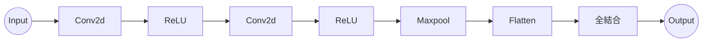

# CNNによるMNISTの学習

ではいよいよ今まで実装してきたCNNの関数を用いてモデルを構築します。なお、Conv2dといったCNNの複雑な行列計算は純Rustで行うため、pythonのNumPyのように行列計算が最適化されておらず、前回の学習、[MNISTの学習](https://chitono.github.io/StuCrs-Book/book-basic/Training/Mnist_training.html)に比べてCPUではとても時間がかかると予想されます。この場合、バッチ数を減らしたり、モデルの層を浅くしたりと少し調整してください。

では学習コードを示します。

```rust
use ndarray::*;
use rand::seq::SliceRandom;
use rand::*;
use std::time::Instant;
use stucrs::config;
use stucrs::core_new::ArrayDToRcVariable;
use stucrs::datasets::*;
use stucrs::functions::loss::softmax_cross_entropy_simple;
use stucrs::functions::neural_funcs::accuracy;
use stucrs::layers::{
    Activation, ActivationLayer, Conv2d, Dense, Dropout, Flatten, Linear, Maxpool2d,
};
use stucrs::models::{BaseModel, Model};
use stucrs::optimizers::{Optimizer, SGD};

fn main() {
    let mnist = MNIST::new();
    let x_train = mnist.train_img.view();
    let y_train = mnist.train_label.view();
    let x_test = mnist.test_img.view();
    let y_test = mnist.test_label.view();

    let _image_num = 0;

    //println!("{:#.1?}\n", mnist.get_item(image_num));

    //println!("{:?}", x_train.shape());

    //println!("{:?}", y_train.shape());

    let y_train = arr2d_to_one_hot(y_train.mapv(|x| x as u32).view(), 10);
    let y_test = arr2d_to_one_hot(y_test.mapv(|x| x as u32).view(), 10);

    let max_epoch = 1;
    let lr = 0.01;
    let batch_size = 1000;

    let data_size = x_train.shape()[0];
    println!("data_size={}", data_size);

    let mut model = BaseModel::new();
    model.stack(Conv2d::new(32, (5, 5), (1, 1), (0, 0), false));
    model.stack(ActivationLayer::new(Activation::Relu));
    model.stack(Conv2d::new(32, (5, 5), (1, 1), (0, 0), false));
    model.stack(ActivationLayer::new(Activation::Relu));
    model.stack(Maxpool2d::new((2, 2), (1, 1), (0, 0)));

    model.stack(Flatten::new());

    model.stack(Dense::new(256, true, None, Activation::Relu));
    model.stack(Linear::new(10, true, None));

    let mut optimizer = SGD::new(lr);
    optimizer.setup(&model);
    let start = Instant::now();

    for epoch in 0..max_epoch {
        let mut indices: Vec<usize> = (0..data_size).collect();
        let mut rng = thread_rng();
        indices.shuffle(&mut rng);

        let mut sum_loss = array![0.0f32];
        let mut sum_acc = 0.0f32;

        for chunk_indices in indices.chunks(batch_size) {
            let x_batch = x_train.select(Axis(0), chunk_indices).to_owned().rv();
            let y_batch = y_train.select(Axis(0), chunk_indices).to_owned().rv();

            let y = model.call(&x_batch);
            println!("1");
            let mut loss = softmax_cross_entropy_simple(&y, &y_batch);
            println!("2");
            let acc = accuracy(
                y.data().into_dimensionality().unwrap().view(),
                y_batch.data().into_dimensionality().unwrap().view(),
            );
            model.cleargrad();
            loss.backward(false);
            println!("3");
            optimizer.update();
            println!("4");

            let epoch_loss: Array1<f32> = (&loss.data() * (y_batch.len() as f32))
                .into_dimensionality()
                .unwrap();

            sum_loss = &sum_loss + &epoch_loss;
            sum_acc = sum_acc + acc * (y_batch.len() as f32);
        }

        let average_loss = &sum_loss / (data_size as f32);
        let average_acc = sum_acc / (data_size as f32);

        println!(
            "epoch = {:?}, train_loss = {:?}, accuracy = {}",
            epoch + 1,
            average_loss,
            average_acc
        );

        //推論
        config::set_grad_false();
        let test_data_size = x_test.shape()[0];
        let mut indices: Vec<usize> = (0..test_data_size).collect();
        let mut rng = thread_rng();
        indices.shuffle(&mut rng);

        let mut sum_loss = array![0.0f32];
        let mut sum_acc = array![0.0f32];

        for chunk_indices in indices.chunks(batch_size) {
            let x_batch = x_test.select(Axis(0), chunk_indices).to_owned().rv();
            let y_batch = y_test.select(Axis(0), chunk_indices).to_owned().rv();

            //println!("x_batch = {:?}, t_batch = {:?}", x_batch, t_batch);

            let y = model.call(&x_batch);
            let loss = softmax_cross_entropy_simple(&y, &y_batch);
            let acc = accuracy(
                y.data().into_dimensionality().unwrap().view(),
                y_batch.data().into_dimensionality().unwrap().view(),
            );

            let epoch_loss: Array1<f32> = (&loss.data() * (y_batch.len() as f32))
                .into_dimensionality()
                .unwrap();

            sum_loss = &sum_loss + &epoch_loss;
            sum_acc = sum_acc + acc * (y_batch.len() as f32);
        }

        let average_loss = &sum_loss / (test_data_size as f32);
        let average_acc = sum_acc / (test_data_size as f32);

        println!(
            "epoch = {:?}, test_loss = {:?}, test_accuracy = {}",
            epoch + 1,
            average_loss,
            average_acc
        );

        config::set_grad_true();
    }
    let end = Instant::now();
    let duration = end.duration_since(start);
    println!("処理時間{:?}", duration);
}
```

基本的な構成は基礎編で書いた[MNISTの学習](https://chitono.github.io/StuCrs-Book/book-basic/Training/Mnist_training.html)と同じです。違う点はMNISTデータの四次元化とモデルの層です。

- MNISTのデータ
 前のMNISTデータは画像を1次元にフラットにしたのでバッチを合わせて二次元でした。しかし、今回は画像を二次元として、さらにチャンネル数も考慮するため四次元\\((N,C,K,W)\\)に変換します。MNISTは白黒なので、チャンネル数は1です。

- モデルの構築
 ここでは一番シンプルで一般的なCNNのモデルを構築します。引数はなどに注意して設定します。


基本的な構造は、



となっています。Conv2dとMaxpoolでActivationレイヤーを挟むよう、層を重ねます。

パラメーターやモデルの層をうまく調整すれば、90%以上の精度を出すことができると思います。また、精度の上昇が鈍い場合、Optimizerの学習率の数値を大きくすると速く上昇します。逆に大きすぎると、lossが爆発的に増加する恐れがあるので、試して調整しましょう。
